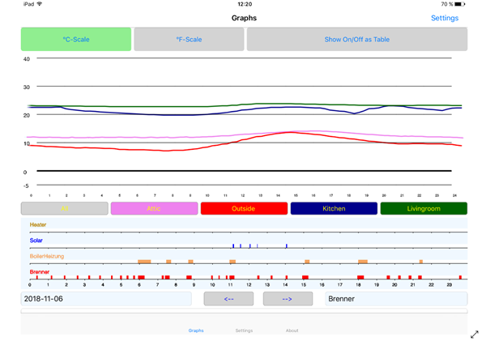

# AzureDataSender_FEZ
This is work in progress. It works now (23.02.2019) quite stable but isn't tested over longer periods.

App for GHI Electronics FEZ with SPWF04SA Board writes data to Azure Storage Tables to be visualized by Microsoft Azure Storage Explorer or the iOS App ['AzureTabStorClient'](https://itunes.apple.com/us/app/azuretabstorclient/id1399683806). For details visit this Page

Data stored (in special format) in Azure Storage Tables can then be visulized with the iOS App Store App: ['Charts4Azure'](https://itunes.apple.com/us/app/charts4azure/id1442910354?mt=8)

For details visit this [Page](https://azureiotcharts.home.blog/)

Instructions to a similar project for the Beaglebone Green are provided on Hackster.io:
https://www.hackster.io/RoSchmi/mono-c-app-sending-sensor-data-to-azure-storage-tables-0de137
